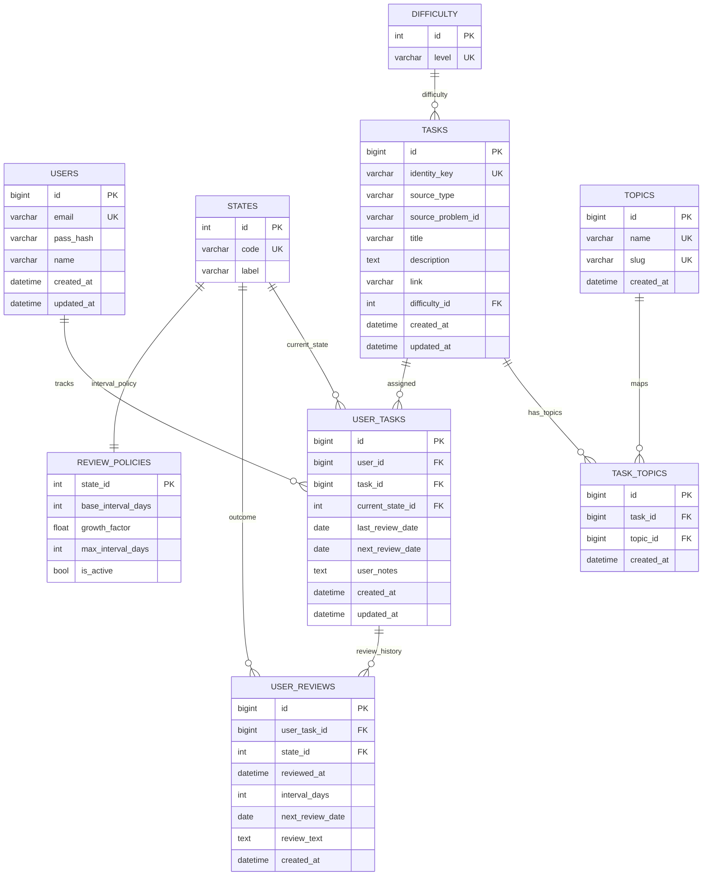

# Database Model

This document describes the logical data model for LeetCode Tracker.

## Architectural rules

- `USER_REVIEWS` is the source of truth for review history.
- `USER_TASKS` stores the operational snapshot and the next review date.
- `TASK_TOPICS` implements the many-to-many relationship between tasks and topics.
- Legacy user-specific tables are normalized into shared tables with `user_id`.
- Users interact only with their own tasks; the server manages the shared task lifecycle transparently.

## Integrity constraints

- `UNIQUE(user_id, task_id)` in `USER_TASKS`;
- `UNIQUE(task_id, topic_id)` in `TASK_TOPICS`;
- `UNIQUE(identity_key)` in `TASKS`;
- cascading deletes from users/tasks to relationships and review history;
- unique dictionary values for topic names, difficulty levels, and state codes.

## Table groups

### Reference tables

- `DIFFICULTY`: problem difficulty levels.
- `STATES`: review outcomes.
- `TOPICS`: normalized problem topics.
- `REVIEW_POLICIES`: interval rules for each review outcome.

### Operational tables

- `USERS`: accounts and profile attributes.
- `TASKS`: shared problem cards and deduplication identity keys.
- `TASK_TOPICS`: task/topic relationships.
- `USER_TASKS`: the user's current tracking state for a task.

### Reporting table

- `USER_REVIEWS`: the complete review history used for analytics and learning trends.

## Task lifecycle

When a user adds a problem, the backend calculates `identity_key`, reuses an existing `TASKS` record where possible, and creates the user's `USER_TASKS` relationship. When a user removes a problem, only that relationship is removed; the shared task remains while other users reference it.
