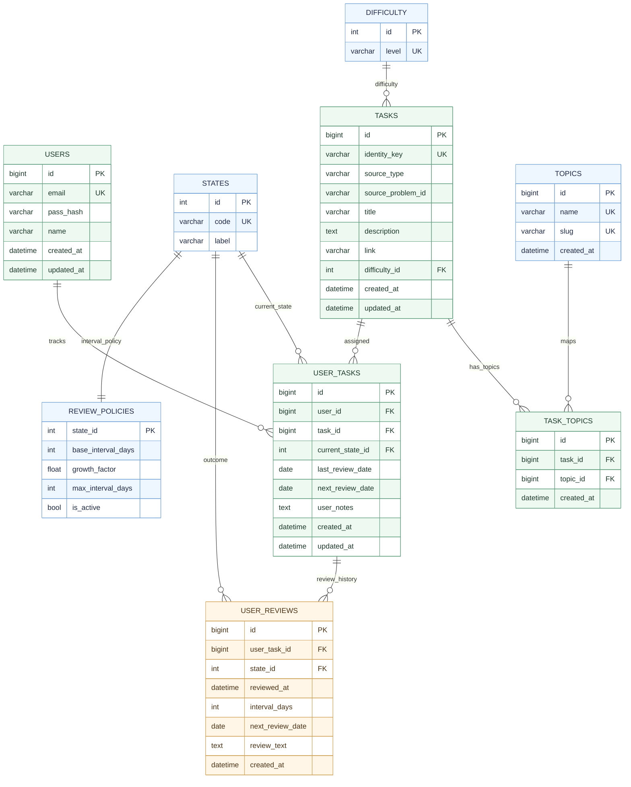

# DATABASE_DIAGRAM

Логическая ER-диаграмма структуры данных Leetcode Tracker в виде табличек.

Ключевые архитектурные правила:

- Источник истины для истории повторений: USER_REVIEWS.
- USER_TASKS хранит оперативный срез (текущее состояние и ближайшую дату повторения).
- Связь между задачами и темами реализована как many-to-many через TASK_TOPICS.
- Пользовательские таблицы из старого вида `<user_id>_*` нормализованы в общие таблицы с полем `user_id`.
- Конечный пользователь работает только со своими задачами, а общий жизненный цикл TASKS управляется сервером прозрачно.

Критичные ограничения целостности:

- UNIQUE(user_id, task_id) в USER_TASKS.
- UNIQUE(task_id, topic_id) в TASK_TOPICS.
- UNIQUE(identity_key) в TASKS.
- ON DELETE CASCADE: USERS -> USER_TASKS, TASKS -> USER_TASKS, USER_TASKS -> USER_REVIEWS, TASKS -> TASK_TOPICS, TOPICS -> TASK_TOPICS.
- Уникальность справочников: TOPICS.name, DIFFICULTY.level, STATES.code.

Цветовая легенда диаграммы:

- Светло-голубой: справочники.
- Светло-зелёный: оперативные таблицы.
- Светло-песочный: отчётные таблицы.

## Пояснения по категориям таблиц

### Справочники

#### DIFFICULTY

Что хранит: справочник уровней сложности задач.

Пример данных: id = 2, level = medium.

#### STATES

Что хранит: справочник исходов повторения.

Пример данных: id = 1, code = dont_remember, label = Не помню.

#### TOPICS

Что хранит: справочник тем, которые можно назначать задачам.

Пример данных: id = 5, name = Dynamic Programming, slug = dynamic-programming.

#### REVIEW_POLICIES

Что хранит: правила расчёта интервалов для каждого состояния из STATES.

Пример данных: state_id = 3, base_interval_days = 7, growth_factor = 1.8, max_interval_days = 120, is_active = true.

### Оперативные таблицы

#### USERS

Что хранит: учётные записи пользователей системы.

Пример данных: id = 12, email = <anna.dev@example.com>, name = Anna, created_at = 2026-04-01 10:00:00.

#### TASKS

Что хранит: общую карточку задачи, не привязанную к конкретному пользователю, включая внутренний ключ идентичности для дедупликации.

Пример данных: id = 101, identity_key = lc:1, source_type = leetcode, source_problem_id = 1, title = Two Sum, difficulty_id = 1.

#### TASK_TOPICS

Что хранит: связь многие-ко-многим между задачами и темами.

Пример данных: id = 900, task_id = 101, topic_id = 5.

#### USER_TASKS

Что хранит: факт отслеживания конкретной задачи конкретным пользователем и её текущее состояние.

Пример данных: id = 3001, user_id = 12, task_id = 101, current_state_id = 2, last_review_date = 2026-03-30, next_review_date = 2026-04-02.

### Отчётные таблицы

#### USER_REVIEWS

Что хранит: полную историю всех повторений пользователя по задаче; используется как источник истины для аналитики и динамики обучения.

Пример данных: id = 70001, user_task_id = 3001, state_id = 3, reviewed_at = 2026-04-01 08:40:00, interval_days = 7, next_review_date = 2026-04-08.

## Жизненный цикл задачи в TASKS

### При добавлении задачи в кабинет пользователя

- Backend вычисляет внутренний `identity_key` по данным входной задачи.
- Если задача с таким ключом уже есть в TASKS, сервер не создаёт дубль и создаёт только связь в USER_TASKS.
- Если задачи нет, сервер создаёт запись в TASKS, после этого создаёт связь в USER_TASKS.
- Для пользователя это единый сценарий: задача добавлена.

### При удалении задачи из кабинета пользователя

- Backend удаляет связь пользователя в USER_TASKS.
- Затем backend проверяет, остались ли другие ссылки на этот `task_id` в USER_TASKS.
- Если ссылки остались, TASKS сохраняется.
- Если ссылок больше нет, backend удаляет orphan-запись из TASKS и связанные TASK_TOPICS.
- Для пользователя это единый сценарий: задача удалена из его списка.
