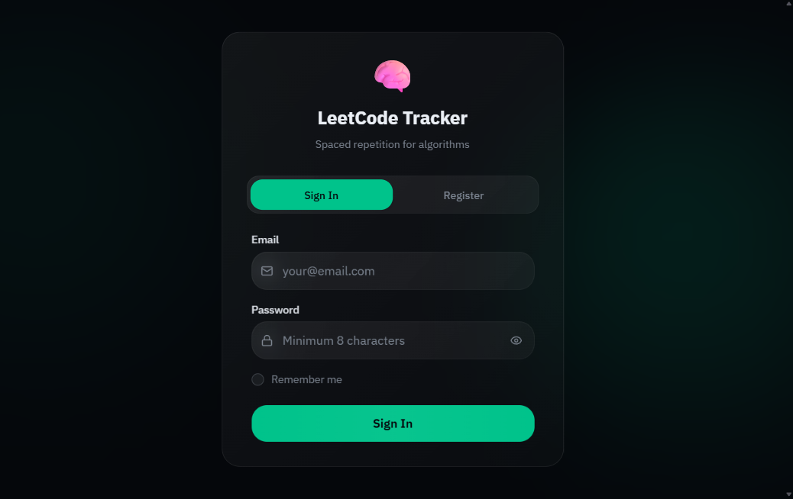
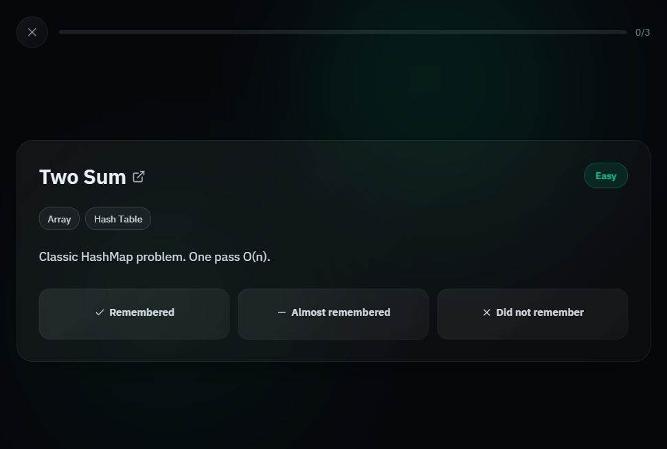

# Текущее состояние фронтенда

## Оглавление

- [Цель документа](#цель-документа)
- [Канонические источники](#канонические-источники)
- [Карта фронтенд-части](#карта-фронтенд-части)
- [Состояние приложения frontend](#состояние-приложения-frontend)
- [Состояние приложения frontend-new](#состояние-приложения-frontend-new)
- [Запуск и проверки](#запуск-и-проверки)
- [Примеры интерфейса из корня](#примеры-интерфейса-из-корня)
- [Ограничения текущей реализации](#ограничения-текущей-реализации)

## Цель документа

Этот файл фиксирует фактическое состояние фронтенд-части в репозитории на текущий момент и помогает быстро понять, где находится рабочий UI и где идет активное развитие.

## Канонические источники

- Базовое описание проекта: [README.md](README.md)
- Технический baseline и правила: [README.developers.md](README.developers.md)
- Контракт взаимодействия frontend/backend: [BACKEND_FRONTEND_CONTRACT.md](BACKEND_FRONTEND_CONTRACT.md)
- Продуктовый контекст и направления: [ТЗ.md](ТЗ.md)

## Карта фронтенд-части

В репозитории поддерживаются две клиентские реализации:

- `frontend` - рабочая версия на React + Vite + TypeScript с классической page/navigation структурой.
- `frontend-new` - новая версия интерфейса с расширенным UX, компонентной компоновкой, панелями и тестами.

Обе реализации сейчас работают в локальном режиме хранения данных (через browser storage), что соответствует этапу до полной серверной интеграции.

## Состояние приложения frontend

Текущее поведение:

- Главный контейнер строится вокруг `AppHeader`, `AppNav`, `AppFooter`.
- Основные экраны: Home, Add Task, Review, Stats, Settings.
- Реализованы ключевые действия: добавление задачи, удаление задачи, запись результата ревью.
- Есть keyboard-навигация для переключения экранов и автоочистка уведомлений.
- При отсутствии сессии выполняется redirect на экран входа.

Технические признаки:

- Скрипты: `dev`, `build`, `lint`, `preview`.
- Зависимости включают React 19, React Router 7, Zod.
- Бизнес-данные задач и сессии пользователя сохраняются локально через shared storage utilities.

## Состояние приложения frontend-new

Текущее поведение:

- Приложение построено вокруг `RootLayout` и фонового слоя `AmbientBackground`.
- Домашний и review-режимы переключаются через состояние view с плавным переходом.
- Навигация и вспомогательные действия вынесены в `ProfileMenu` и `SidePanel`.
- Добавление задачи реализовано через FAB (`AddTaskFab`) и модальный flow (`AddTaskModal`).
- Logout подтверждается через `ConfirmDialog`.
- Аутентификация и задачи также работают через локальное storage-хранилище.

Технические признаки:

- Скрипты: `dev`, `build`, `preview`, `typecheck`, `lint`, `test`, `test:watch`.
- Используются Tailwind CSS v4, Vitest, Testing Library.
- Есть unit-тесты в `src/__tests__` (валидация URL, review-feedback, прогресс, расписание и reducer-flow).
- Типы задач расширены полями источника (`source`, `sourceMeta`) и режимом планирования (`scheduleMode`).

## Запуск и проверки

`frontend`:

1. Перейти в папку `frontend`.
2. Установить зависимости: `npm install`.
3. Запуск разработки: `npm run dev`.

`frontend-new`:

1. Перейти в папку `frontend-new`.
2. Установить зависимости: `npm install`.
3. Запуск разработки: `npm run dev`.
4. Проверки качества: `npm run typecheck`, `npm run lint`, `npm run test`.

## Примеры интерфейса из корня

Ниже изображения из корня репозитория как референс текущего UI.

### Экран входа

### Домашний экран

### Панель библиотеки

### Раскрытая библиотека

### Сессия повторения

### Панель профиля

## Ограничения текущей реализации

- Обе фронтенд-версии пока используют локальное хранилище вместо backend API.
- Для production-ready сценариев потребуется перенос auth/tasks/review операций на backend-контракт из [BACKEND_FRONTEND_CONTRACT.md](BACKEND_FRONTEND_CONTRACT.md).
- Желательно со временем выбрать один основной frontend-контур для ускорения доставки изменений и снижения дублирования.
