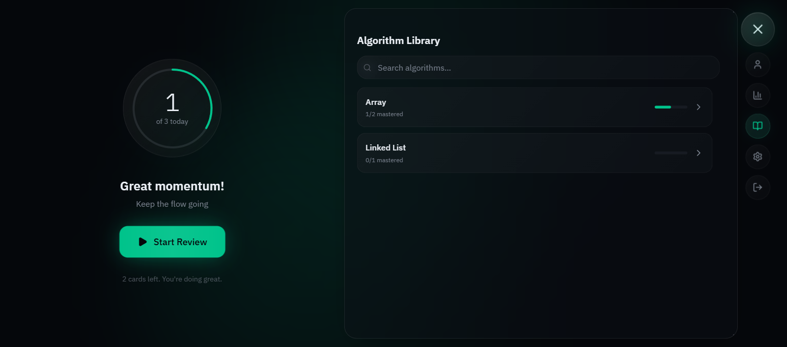
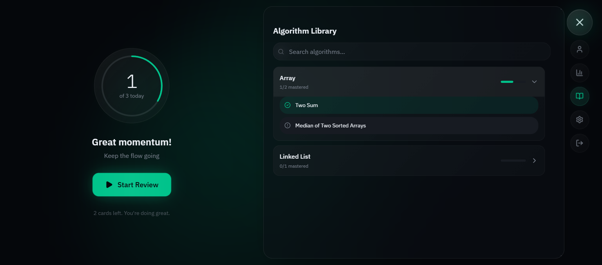
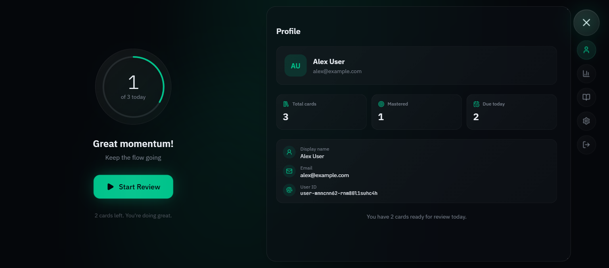
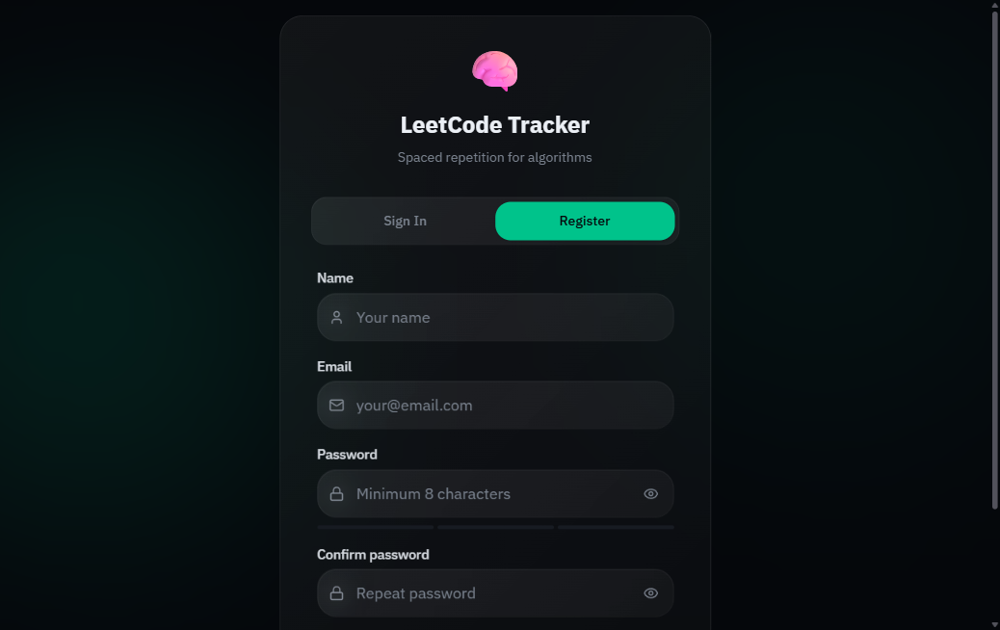

# LeetCode Tracker

LeetCode Tracker is a personal learning system for deliberate algorithm practice, spaced repetition, and long-term progress tracking.

The project combines a polished React interface with a backend-oriented domain model designed around tasks, review history, scheduling policies, topics, and learning analytics.

## Product vision

- add and organize algorithm problems from external sources such as LeetCode;
- review problems using a simple recall-quality workflow;
- automatically schedule the next review date;
- track progress, review outcomes, topics, difficulty, and future workload;
- keep the domain model ready for server-side synchronization across devices.

## Technology

- Frontend: React, Vite, TypeScript, Tailwind CSS v4
- Backend direction: Java, Spring, and PostgreSQL
- Frontend quality: Vitest, Testing Library, type checking, and ESLint

## Current status

The frontend is the active working application and currently uses browser storage as an interim persistence layer. The Java/Spring backend and PostgreSQL integration are defined as the target server architecture and are documented in the API contract and product specification.

## Run the frontend

```bash
cd frontend
npm install
npm run dev
```

Useful checks:

```bash
npm run build
npm run typecheck
npm run lint
npm run test
```

## Interface preview

The repository includes captured interface states from the working frontend:

| Sign in | Home | Review session |
|---|---|---|
|  |  |  |

| Library panel | Expanded library | Profile panel |
|---|---|---|
|  |  |  |

| Registration | Open home menu |
|---|---|
|  |  |

## Documentation

- [Developer README](README.developers.md)
- [Frontend current state](FRONTEND_CURRENT_STATE.md)
- [Backend/frontend contract](BACKEND_FRONTEND_CONTRACT.md)
- [Database model](DATABASE_DIAGRAM.md)
- [Product specification](PRODUCT_SPECIFICATION.md)

## License

This project is available under the [Creative Commons Attribution-NonCommercial 4.0 International license](LICENSE). Attribution to Loginov Gleb is required; commercial use is not permitted.
