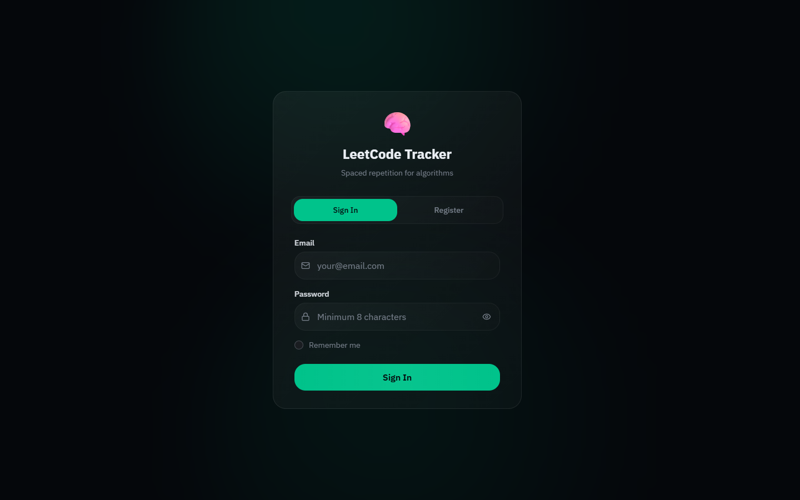
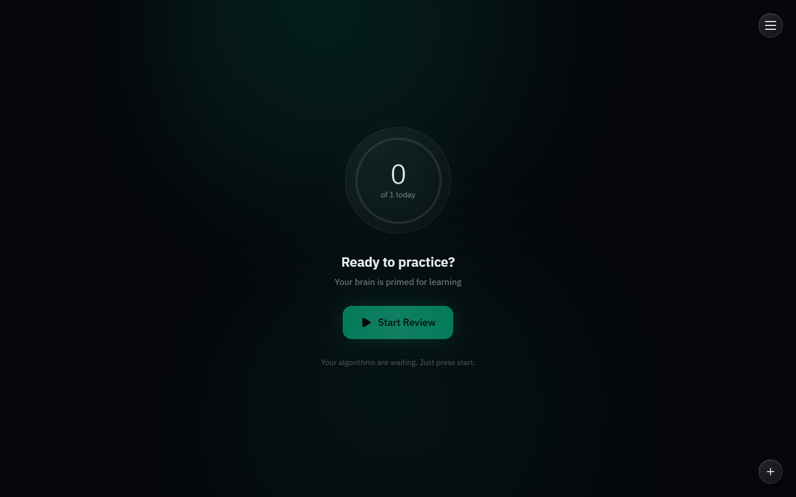
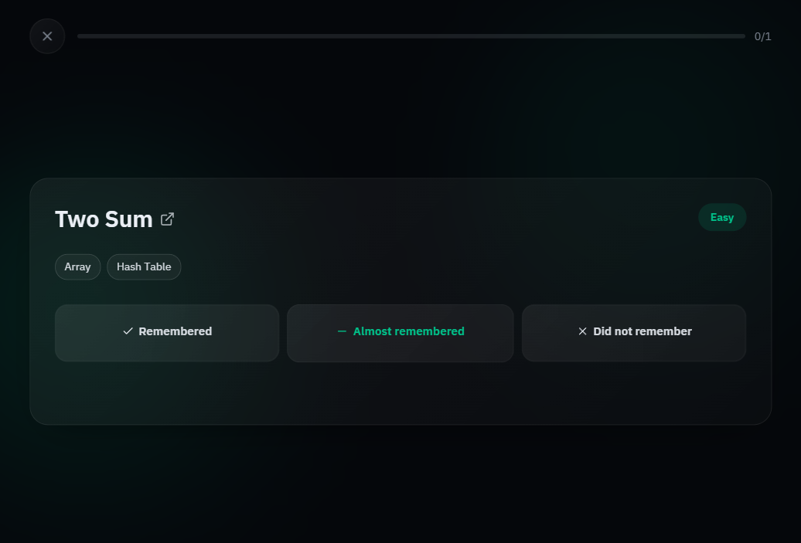
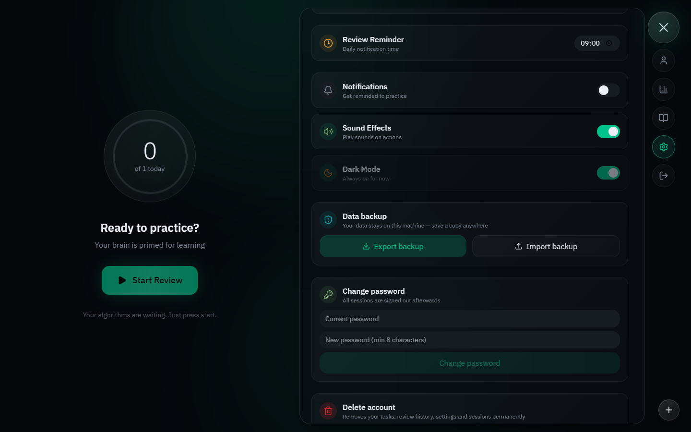
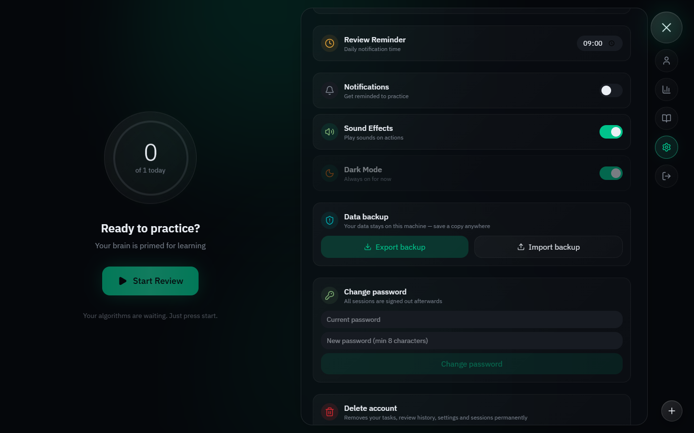

# LeetCode Tracker

A **local-first** tracker for deliberate algorithm practice: add LeetCode problems, review them with a recall-quality workflow, and let spaced repetition schedule the next review date. All your data lives on your own machine — no cloud, no accounts on someone else's server.

- Add and organize problems from LeetCode (URL parsing and validation built in)
- Review today's queue, grade recall quality, next date computed automatically
- Progress tracking: streaks, difficulty/source distribution, workload
- Export/import your data as a JSON backup file
- Email-verified registration with OTP (works with a real SMTP server or a built-in dev fallback)

## Screenshots

| Sign in | Home | Review session |
|---|---|---|
|  |  |  |

| Review queue | Settings — backup | Settings — account |
|---|---|---|
|  |  |  |

## Quick start

**Requirements:** [Docker](https://docs.docker.com/get-docker/) with the Compose plugin (Docker Desktop works out of the box).

```bash
git clone <repo-url>
cd Leetcode-tracker
docker compose up --build
```

Then open **http://localhost** in your browser.

Register with any email and password. By default no SMTP server is configured, so the app uses the **dev fallback**: the verification (OTP) code is printed to the backend container log instead of being emailed:

```bash
docker compose logs backend | grep -i otp   # or just: docker compose logs backend
```

Enter the code from the log into the verification form, and you're in.

### Email modes

- **Dev fallback (default):** `APP_MAIL_HOST` empty → OTP codes are written to the backend log. Zero configuration.
- **Maildev (local SMTP + web UI):** run the optional profile and point the app at it:
  ```bash
  docker compose --profile mail up
  ```
  Set in `.env` (copy from `.env.example`):
  ```
  APP_MAIL_HOST=maildev
  APP_MAIL_PORT=1025
  ```
  Emails are visible at http://localhost:1080.
- **Real SMTP (e.g. Gmail):** set in `.env`:
  ```
  APP_MAIL_HOST=smtp.gmail.com
  APP_MAIL_PORT=587
  APP_MAIL_USERNAME=you@gmail.com
  APP_MAIL_PASSWORD=your-16-char-app-password
  APP_MAIL_FROM=you@gmail.com
  ```
  For Gmail, create an [app password](https://myaccount.google.com/apppasswords) — your regular password won't work.

Configuration is entirely via `.env` (see `.env.example` for all variables and defaults). You don't need an `.env` file at all for local use — the defaults work out of the box.

### Backup and restore

Open **Settings → Backup** in the app: **Export** downloads a JSON file with all your tasks, review history, and statistics; **Import** restores it (idempotent — safe to run twice). This is the local-first way to move data between machines or recover from a lost database volume.

### Deploying on your own server

The stack is container-ready; only `.env` changes are needed:

1. Copy `.env.example` to `.env` and adjust:
   - `POSTGRES_PORT`, `BACKEND_PORT`, `FRONTEND_PORT` — avoid collisions with other services.
   - `APP_JWT_SECRET` — **generate your own**, e.g. `openssl rand -hex 32`. The committed default is dev-only.
   - SMTP variables as above.
   - `APP_CORS_ORIGINS` — the origin where the frontend is served.
2. Put the stack behind your reverse proxy (nginx/traefik) terminating TLS.
3. `docker compose up -d --build`.

## For developers

**Backend** (Java 21, Spring Boot 4, Flyway, PostgreSQL; tests use Testcontainers):

```bash
cd backend
cp .env.example .env   # optional; dev defaults work
./gradlew bootRun      # run against a local PostgreSQL (docker compose up postgres)
./gradlew build        # compile + tests (needs Docker for Testcontainers)
```

**Frontend** (React 19, Vite, TypeScript, Tailwind CSS v4):

```bash
cd frontend
cp .env.example .env   # optional
npm ci
npm run dev            # http://localhost:5173, proxies /api to http://localhost:8080
npm run typecheck && npm run lint && npm run test && npm run build
```

**Architecture and docs:**

- [ROADMAP.md](ROADMAP.md) — project roadmap and stage history
- [PRODUCT_SPECIFICATION.md](PRODUCT_SPECIFICATION.md) — product context and feature spec
- [BACKEND_FRONTEND_CONTRACT.md](BACKEND_FRONTEND_CONTRACT.md) — REST API contract
- [DATABASE_DIAGRAM.md](DATABASE_DIAGRAM.md) — database schema
- [FRONTEND_CURRENT_STATE.md](FRONTEND_CURRENT_STATE.md) — current frontend state
- [README.developers.md](README.developers.md) — extended developer notes

**CI:** GitHub Actions runs backend tests/build and frontend typecheck/lint/test/build on every push and pull request to `main` (see [.github/workflows/ci.yml](.github/workflows/ci.yml)).

## License

[MIT](LICENSE) © 2026 Loginov Gleb ([gleb7499](https://github.com/gleb7499)).
